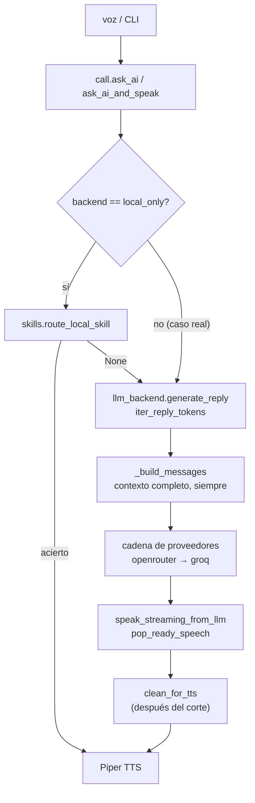
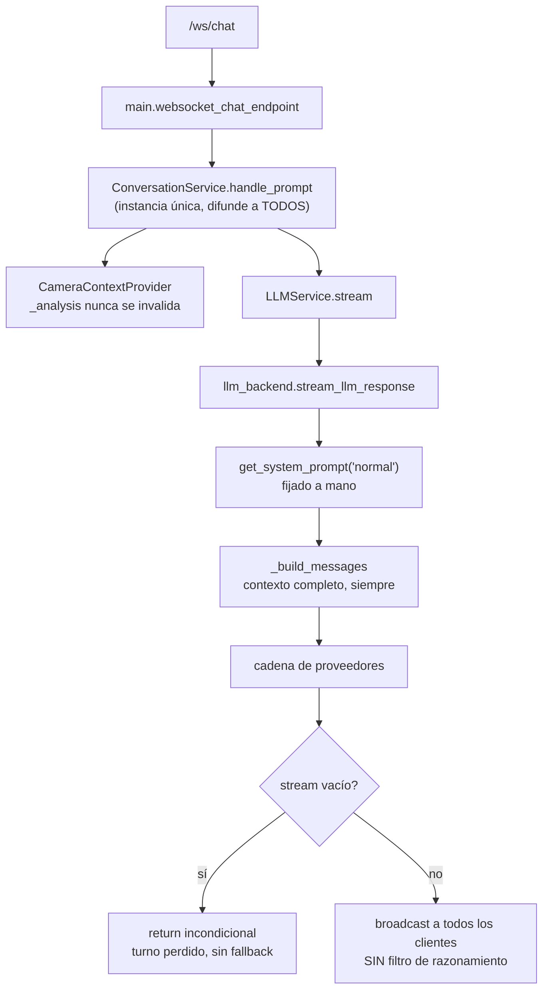
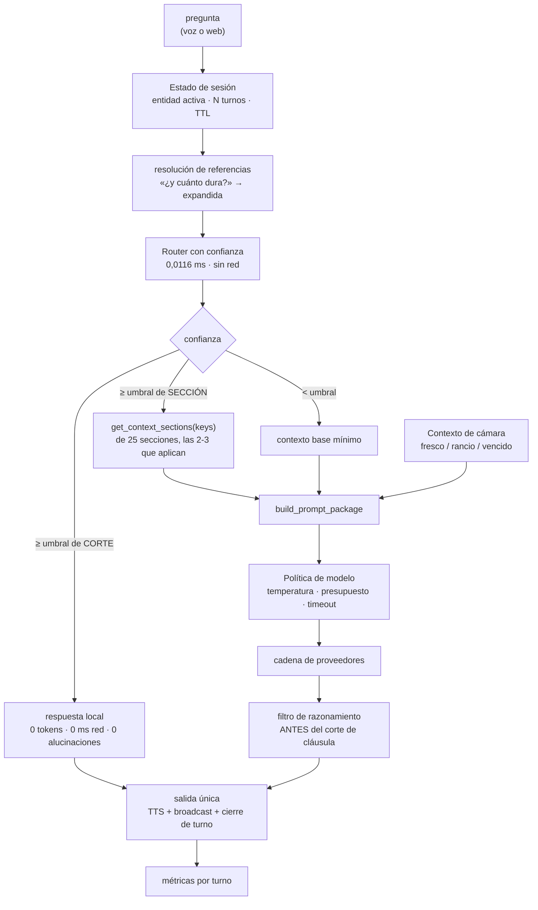

# Plan de arquitectura de contexto y modelos — Holograma UNEV

| | |
|---|---|
| **Fecha** | 2026-07-30 |
| **Commit base** | `6458e07` (rama `main`) |
| **Alcance** | Auditoría del sistema de contexto, prompt, memoria y política de modelos |
| **Código modificado** | **Ninguno.** Este documento es análisis y plan |
| **Runbook de ejecución** | `execution/` — 10 WAVEs, una por archivo |
| **Medido con** | El `.env` y `config.json` reales del equipo, en runtime, sobre la suite de tests |

> **Sobre secretos.** Todas las mediciones se hicieron con la configuración viva del equipo. En
> este documento aparecen **nombres de variables, proveedor seleccionado y modelo configurado**.
> Ningún valor de clave, ni completo ni parcial. `config.json` contiene claves en texto plano y
> **no se ha pegado aquí ni en ningún otro archivo del plan** — ver SEC-1 en §2.

---

## 1. Resumen ejecutivo

El Holograma UNEV envía **~18.400 caracteres de contexto institucional en cada turno**, idénticos
siempre, sin importar la pregunta. La pregunta del visitante pesa **entre el 0,3 % y el 0,4 %**
del prompt. La variación del contexto según lo que se pregunte es de **0 %**.

Eso no es lo peor. Lo peor es la combinación de tres cosas que, juntas, explican por qué el
sistema falla en vivo:

1. **Un modelo de razonamiento con 180 tokens de presupuesto compartido** entre el *thinking* y
   la respuesta. Cuando el razonamiento se come el presupuesto, el visitante no recibe nada.
2. **Un `return` incondicional en la ruta web** que hace que un turno vacío termine en silencio,
   sin intentar el proveedor siguiente.
3. **El aviso que explica exactamente esto ya está escrito en el repositorio** —
   `"[LLM/CoT] AVISO: solo hubo razonamiento (CoT), sin respuesta útil"`— y la configuración del
   equipo (`LLM_LOG_COT=0`) lo tiene apagado. El código sabía cuál era el problema; el
   interruptor del log silenció al mensajero.

A eso se suma un peor caso de **~180 segundos antes de la primera palabra** (dos proveedores × 90 s
de timeout, con un identificador de modelo que se filtra entre proveedores y garantiza un 404), y
un router local que responde **«vulgarismos hondureños»** a «Háblame de Programación Web», porque
el literal `"habla"` está en la lista de vulgarismos y se evalúa antes que todo el enrutado UNEV.

La recomendación es la **opción F: híbrido determinista** — recuperación de contexto por secciones
guiada por un router con confianza y umbral, más memoria de sesión acotada, más corte pre-LLM para
lo que ya sabemos responder. **Sin embeddings, sin base vectorial, sin llamada de clasificación al
LLM.** El motivo es medido, no ideológico: construir el contexto cuesta **0,129 ms en frío** y el
enrutado local **0,0116 ms**; una llamada de red para clasificar costaría 200–800 ms. Sería pagar
cuatro órdenes de magnitud para resolver un problema que ya es instantáneo.

La reducción alcanzable con recuperación selectiva, medida sobre las 11 preguntas de referencia,
es del **90,1 % de media** (18.439 → 1.833 caracteres; rango 83,6–95,1 %).

El plan se ejecuta en **10 WAVEs**, y **la Fase 1 (WAVEs 01–03) es entregable por sí sola**: son
las tres que arreglan lo que rompe la demo.

---

## 2. Estado real del repositorio

### Lo que hay

Un asistente de kiosco multimodal: LLM + voz (STT Whisper vía Groq, TTS Piper local) + cámara
(YOLO) + skills locales de contenido + control de ventiladores holográficos físicos. Backend
FastAPI con una ruta WebSocket, y un bucle de voz síncrono independiente.

```
203 funciones de test en 28 archivos → 209 casos ejecutados, todos pasando (exit 0)
```

> La diferencia entre **203 funciones** y **209 casos** es parametrización de pytest. Ambos
> números son correctos y describen cosas distintas. El runbook cita 203; si al ejecutar ves 209
> pasando, está bien.

### El agujero de cobertura

```
0 tests cubren skills/router.py, skills/university.py, skills/honduras.py,
  skills/utils.py, skills/event_mode.py
```

Cinco módulos sin una sola prueba, y son exactamente los que deciden **qué sabe y qué dice** el
holograma. Es el punto de partida de WAVE-10.

### Configuración viva (sin secretos)

```
proveedor primario : openrouter
modelo             : nvidia/nemotron-3-nano-30b-a3b:free   (razonamiento, tier free)
cadena cloud       : ['openrouter', 'groq']
groq               : clave presente (sirve al STT: whisper-large-v3-turbo)
LLM_MAX_TOKENS     : 180
LLM_REQUEST_TIMEOUT: 90.0 s
LLM_LOG_COT        : False
```

Variables leídas: `LLM_BACKEND`, `LLM_MODEL`, `LLM_MAX_TOKENS`, `LLM_REQUEST_TIMEOUT`,
`LLM_LOG_COT`, `OPENROUTER_API_KEY`, `OPENROUTER_MODEL`, `GROQ_API_KEY`, `GROQ_MODEL`.

### Hallazgos de estado, fuera del alcance de las 10 WAVEs

- **SEC-1 · Clave en texto plano.** `config.json` guarda una clave de Groq en claro, y es el
  almacén **principal**: `POST /api/config` persiste ahí todas las claves. **No está en git**
  (verificado con `git ls-files`). **Recomendación: rotar esa clave** y consolidar los secretos en
  `.env`. No es una WAVE porque no es un cambio de código: es una acción del operador, y es la
  primera de la lista.
- **INFO-1 · Discrepancia de proveedor en la documentación previa.** Documentos anteriores asumían
  Groq + `qwen3-8b-instant` como ruta de chat. La configuración viva es OpenRouter + nemotron; la
  clave de Groq existe pero sirve al STT. Cualquier documento que diga lo contrario está
  desactualizado.
- **INFO-2 · La capa de herramientas web nunca existió.** `git log --all -S` devuelve **cero**
  commits. No hay nada que "restaurar". Si se quiere búsqueda web, es obra nueva y necesita su
  propio plan.

### Inventario de hallazgos

Quince hallazgos confirmados en runtime, `A`–`O`, y cinco hipótesis de partida, todas confirmadas.

| # | Hallazgo | WAVE |
|---|---|---|
| A | No hay historial de conversación en ninguna de las dos rutas | 06 |
| B | `return` incondicional en `stream_llm_response`: un stream vacío termina el turno sin fallback | 01 |
| C | `LLM_MODEL` genérico se filtra entre proveedores → 404 garantizado en el segundo salto | 01 |
| D | El holograma pronuncia su propio razonamiento en voz alta | 02 |
| E | `max_tokens=180` insuficiente para un modelo de razonamiento | 01 |
| F | `temperature=0.6` fijada a mano en **seis** sitios, sin política por tipo de consulta | 09 |
| G | Presupuesto de tokens **único**, compartido entre razonamiento y respuesta | 09 |
| H | El modo de evento (`judges`/`expo`/`admissions`) no llega a la ruta web | 07 |
| I | No hay tope al contexto **ensamblado**: peor caso ~200 KB en un prompt | 05 |
| J | Dos listas de palabras visuales que no coinciden (38 vs 20, sólo 16 comunes) | 08 |
| K | El contexto de cámara nunca se invalida en la ruta web | 08 |
| L | Dos rutas, dos ensamblados del prompt | 05 → 07 |
| M | Timeout de 90 s por proveedor, y avisos de diagnóstico acoplados al log de CoT | 09 |
| N | La frescura de cámara vive en globals de módulo con 60 s fijos | 08 |
| O | Un único `ConversationService` difunde a **todos** los clientes | 06 |

| # | Hipótesis | Resultado |
|---|---|---|
| H1 | El prompt es monolítico y ciego a la pregunta | **Confirmada** — variación 0 % |
| H2 | El contexto es atómico, sin granularidad de sección | **Confirmada** — aunque internamente ya está estructurado en 25 campos |
| H3 | El router no tiene confianza ni umbral | **Confirmada** — primer `if` que coincide gana |
| H4 | El router coincide por subcadena, sin límites de palabra | **Confirmada** — `Europa`→`ropa`, `joven`→`ven`, `Háblame`→`habla` |
| H5 | Las skills locales sólo corren si el backend es `local_only` | **Confirmada** — en producción no corren nunca |

**El hallazgo O no es un defecto.** Es una propiedad deliberada del producto: hay **un** holograma
físico y varias pantallas que miran la misma conversación. Está en la lista porque **restringe el
diseño de la memoria**, no porque haya que arreglarlo. Aislar el estado por socket rompería el
kiosco.

---

## 3. Flujo actual de voz/CLI

Ruta síncrona. Entra por micrófono o por consola, sale por Piper.



Tres cosas a notar en el diagrama, todas confirmadas:

- La guarda `local_only` (`call.py` ≈L983 y ≈L1022) hace que **el rombo siempre vaya por «no»**
  con la configuración real. Las skills locales son inalcanzables salvo como último recurso.
- `_build_messages` recibe el contexto **completo** en todos los casos.
- `clean_for_tts` corre **después** de que `pop_ready_speech` ya cortó la cláusula. Ese orden es
  el hallazgo D: el fragmento de razonamiento ya salió por el parlante cuando se limpia.

## 4. Flujo actual web/WebSocket

Ruta asíncrona. Entra por `/ws/chat`, sale por broadcast a todos los clientes.



- `get_system_prompt("normal")` está **fijado a mano** (≈L1076): el modo de evento de la ruta de
  voz no llega aquí (hallazgo H).
- El `return` incondicional tras el `async for` (≈L1063) es el hallazgo B. `iter_reply_tokens`
  (≈L898), en la otra ruta, **ya lo hace bien**: consulta `produced` y continúa con el proveedor
  siguiente. La corrección es replicar, no inventar.
- El broadcast no aplica ningún filtro de razonamiento: la web muestra el CoT en texto.

**Los dos flujos convergen en `_build_messages` (≈L395) y divergen en todo lo demás.** Ese es el
hallazgo L, y es la razón de que cada arreglo haya que hacerlo dos veces.

---

## 5. Auditoría del prompt actual

### Composición por turno

| Componente | Caracteres | % |
|---|---|---|
| Contexto institucional UNEV | 13.076 | ~71 % |
| Contexto Honduras | 2.438 | ~13 % |
| **Subtotal `get_university_context()`** | **15.516** | **~84 %** |
| Prompt de sistema, modo, andamiaje | ~2.900–3.300 | ~16 % |
| **Pregunta del visitante** | **~50–75** | **0,3–0,4 %** |
| **Total por turno** | **~18.439–18.814** | 100 % |

Tokens de entrada estimados a 3,5 ch/token: **~5.340 por turno, cada turno**.

**Variación del contexto según la pregunta: 0 %.** Es literalmente el mismo bloque para «¿Cómo
estás?» y para «¿Está aprobada por el CES?».

### El techo que no existe

`skills/unev_content.py` define `MAX_FIELD_CHARS = 8000` (≈L28) y lo aplica **por campo** (≈L305,
L313, L315). No hay ningún tope al bloque ensamblado. Con 25 campos al máximo el peor caso es
**~200 KB en un solo prompt** (hallazgo I). Nadie lo ha alcanzado porque el contenido real es
moderado — pero el panel de administración permite editar esos campos desde la web. Es una bomba
de tiempo operativa, no teórica.

### Precisión del router local — línea base medida

`skills/router.py::route_local_skill` (≈L14) normaliza con `normalize_text` (que **quita
acentos**) y encadena `if any(word in text for word in [...])`. Sin confianza, sin umbral, sin
límites de palabra. Gana el primer `if`.

El defecto más grave: el literal **`"habla"`** en la lista de vulgarismos (≈L21 y ≈L40), evaluada
**antes** de todo el enrutado UNEV. `normalize_text("Háblame")` → `"hablame"`, que lo contiene:

```
Háblame de Programación Web        -> Vulgarismos y rasgos lingüísticos del habla hondureña
Háblame de UNEV                    -> Vulgarismos y rasgos lingüísticos del habla hondureña
Háblame de las carreras            -> Vulgarismos y rasgos lingüísticos del habla hondureña
Háblame de la lluvia de peces.     -> Vulgarismos y rasgos lingüísticos del habla hondureña
¿Cuál es el mínimo para entrar?    -> Vulgarismos y rasgos lingüísticos del habla hondureña
```

«Háblame de…» es la forma más natural en que un visitante pide información. Y `"minimo"` captura
una pregunta de **admisión** y la manda al mismo sitio.

Línea base sobre las 11 preguntas de referencia:

| # | Pregunta | Hoy | ¿Correcto? |
|---|---|---|---|
| 1 | ¿Cómo estás? | `None` | ✅ (correctamente al LLM) |
| 2 | ¿Qué significa UNEV? | `None` | ❌ omisión — debería dar las siglas |
| 3 | ¿Qué carreras ofrecen? | resumen de programas | ✅ |
| 4 | ¿Cuánto dura Programación Web? | programa correcto | ✅ |
| 5 | ¿Y cuánto dura? | `None` | ❌ necesita memoria (WAVE-06) |
| 6 | ¿Dónde queda la UNEV? | dirección | ✅ |
| 7 | ¿Está aprobada por el CES? | aprobación CES | ✅ |
| 8 | Háblame de la lluvia de peces. | **vulgarismos** | ❌ sección equivocada |
| 9 | ¿Qué ves frente a ti? | `None` | ✅ (va por cámara) |
| 10 | ¿Cuál es el precio actual…? | `None` | ✅ (sin capacidad web) |
| 11 | Cuéntame un chiste. | `None` | ✅ |

> **Cómo leer este número.** Hay dos denominadores y conviene no mezclarlos:
> - **4 de 7** — de las siete preguntas que **le corresponden al router** (2–8), acierta cuatro.
>   Es la métrica que importa, porque es la que mide el enrutado.
> - **8 de 11** — contando también las cuatro donde devolver `None` es la respuesta correcta.
>
> El objetivo del plan es **≥ 6 de 7 aplicables** (equivalente a **≥ 10 de 11** en total). La
> pregunta 5 sólo es alcanzable con WAVE-06, así que 7 de 7 depende de la memoria, no del router.

### Literales inalcanzables

`normalize_text` quita acentos, así que un literal con acento nunca coincide. **Seis literales
muertos** sin equivalente sin acento:

| Línea | Literal muerto | Consecuencia |
|---|---|---|
| ≈L18 | `"hondureño"`, `"hondureña"`, `"hondureñismo"`, `"hondureñismos"` | «¿qué es un hondureñismo?» no entra en la rama Honduras |
| ≈L37 | `"membreño"` | preguntar por Membreño no llega a próceres |
| ≈L50 | `"investigación"` | la palabra sola no enruta |

Más dos duplicados inofensivos (`"lingüística"` ≈L48, `"contemporáneo"` ≈L52), que sí tienen su
variante sin acento en la misma condición.

> Los literales con acento que se pasan **como argumento** a `get_program_info(...)` son
> **correctos**: son claves de datos, no comparaciones. No se tocan.

---

## 6. Auditoría de contexto y memoria

### No hay memoria. En absoluto.

Verificado firma por firma en toda la cadena:

| Símbolo | Archivo | Firma actual |
|---|---|---|
| `_build_messages` | `llm_backend.py` ≈L395 | `(user_input, system_prompt, university_context, camera_context=None)` |
| `iter_reply_tokens` | `llm_backend.py` ≈L898 | idem |
| `generate_reply` | `llm_backend.py` ≈L944 | idem |
| `stream_llm_response` | `llm_backend.py` ≈L1063 | `(prompt, camera_context=None)` |
| `LLMService.stream` | `app/services/llm.py` | `(prompt, camera_context=None)` |
| `_LLM.stream` (Protocol) | `app/services/conversation.py` ≈L45 | `(prompt, camera_context=None)` |

**No hay un solo parámetro de historial en todo el camino.** Cada turno es el primero. La
consecuencia se mide con la pregunta 5:

```
«¿Cuánto dura Programación Web?»   → 2 años.                          ✅
«¿Y cuánto dura?»                  → router: None; el LLM no sabe de qué.  ❌
```

Un visitante frente a un holograma **no repite el nombre completo de la carrera en cada pregunta**.
Es el patrón conversacional más frecuente de un kiosco, y hoy no existe.

### El modelo de concurrencia restringe el diseño

`main.py` ≈L316 construye **un único** `ConversationService` a nivel de módulo, con un
`ConnectionManager` cuyo `broadcast(...)` —usado en una docena de sitios de `handle_prompt`
(≈L139–L331)— va a **todos** los sockets conectados.

Esto no es un servidor multiusuario: es un kiosco donde varias pantallas miran la misma
conversación. De ahí salen dos reglas **no negociables** para la memoria:

1. **No puede ser por socket.** Aislar por conexión rompe el modelo de kiosco, y una reconexión
   perdería el contexto a mitad de charla.
2. **No puede ser global-para-siempre.** Sin expiración, el visitante nº 2 hereda las preguntas
   del nº 1 y el modelo responde con la carrera de otra persona. **Eso es peor que no tener
   memoria.**

La única forma correcta es **ámbito de dispositivo/sesión con expiración por inactividad**.

### El contexto de cámara caduca y nadie lo dice

- `CameraContextProvider._analysis` **nunca se invalida** (hallazgo K): la ruta web sigue
  describiendo a una persona que ya se fue.
- La frescura vive en globals de módulo (`_last_person_time`, `_cached_person_analysis`) con un
  **60.0 hardcodeado** (hallazgo N).
- Hay **dos listas de palabras visuales que no coinciden** (hallazgo J): 38 en
  `call.py::_is_visual_question` y 20 en `camera_context.py::is_visual_object_question`, sólo 16
  compartidas. «¿Qué traigo puesto?» da `False` por una ruta y `True` por la otra.

---

## 7. Auditoría de proveedores y modelos

### La cadena

`provider_config.py` — `select_backend` ≈L192, `resolve_model` ≈L230, `configured_cloud_providers`
≈L277. Cadena viva: `['openrouter', 'groq']`.

### El 404 garantizado

`resolve_model` cae a un `LLM_MODEL` **genérico** cuando el proveedor no tiene el suyo. Con
`nvidia/nemotron-3-nano-30b-a3b:free` —un identificador con el *namespace* de OpenRouter— ese
mismo string se le pide a **Groq**, que no lo conoce. **404 garantizado en el segundo salto**
(hallazgo C).

Combinado con un timeout de **90,0 s** por proveedor (≈L71–L76), el peor caso es **~180 segundos
antes de la primera palabra**. Y los dos avisos de diagnóstico que lo explicarían están detrás de
`LLM_LOG_COT`, que está en `0`.

### El presupuesto

```
_max_tokens()  (llm_backend.py ≈L44)   default en código: 450
.env del equipo: LLM_MAX_TOKENS=180  →  valor real en runtime: 180
```

El docstring de `_max_tokens` cuenta una historia útil: **antes cada backend traía su propio número
mágico** (350 / 450 / 1024 / sin límite), y la longitud de la respuesta cambiaba según el proveedor
y entre voz y web. Eso **ya está unificado** y fue trabajo correcto. Lo que falta:

- presupuesto **por tipo de consulta**, y
- **separar el presupuesto de razonamiento del de respuesta** — hoy los 180 los comparten
  (hallazgo G).

### La temperatura

`temperature=0.6` fijada a mano en **seis** sitios de `llm_backend.py`: L473, L734, L796, L875,
L1008, L1042 (hallazgo F). El día que alguien toque cinco de las seis, el tono del holograma
pasará a depender de por qué rama del fallback entró la pregunta.

> Los `0.0` de `stt/listener.py` L1055 y L1112 son de **Whisper**. No son parte de esto.

### El modelo elegido

`nvidia/nemotron-3-nano-30b-a3b:free` tiene dos propiedades y las dos juegan en contra:

| Propiedad | Consecuencia para un kiosco en vivo |
|---|---|
| Modelo de **razonamiento** | Gasta presupuesto en *thinking* antes de la primera palabra útil — y ese *thinking* hay que filtrarlo, porque hoy **se pronuncia en voz alta** |
| Tier **`:free`** | Cola compartida y *rate limits*: la latencia depende de cuánta gente use el tier, no de tu red |

Es la peor combinación posible para el único caso de uso que existe: una persona parada frente a
un holograma esperando que hable. **Es la decisión D2, y la toma un humano** (§18).

---

## 8. Medición de tamaño y latencia

Todo medido el 2026-07-29 sobre `main` @ `6458e07`, con la configuración real.

### Tamaño

| Métrica | Valor |
|---|---|
| Contexto institucional | **15.516 chars** (UNEV 13.076 + Honduras 2.438) |
| Prompt total por turno | **~18.439–18.814 chars** |
| Tokens de entrada estimados | **~5.340** |
| Peso de la pregunta | **0,3–0,4 %** |
| Variación según la pregunta | **0 %** |
| Reducción alcanzable con recuperación selectiva | **90,1 % medio** (18.439 → 1.833; rango 83,6–95,1 %) |
| Peor caso teórico del contexto ensamblado | **~200 KB** (25 campos × `MAX_FIELD_CHARS`) |

### Latencia

| Operación | Tiempo |
|---|---|
| `get_university_context()` en frío | **0,129 ms** |
| `get_university_context()` cacheado | ~0 ms |
| `route_local_skill()` | **0,0116 ms** |
| Peor caso de la cadena de fallback | **~180 s** antes de la primera palabra |

### La conclusión que dirige todo el diseño

> **Construir el contexto es gratis. El coste es enviarlo.**

0,129 ms para construirlo, ~5.340 tokens de *prefill* para mandarlo, en cada turno. Y el enrutado
local ya cuesta **0,0116 ms**.

Ese par de números es el argumento entero contra las opciones D y E de §9: **una llamada de red
para clasificar o para buscar cuesta 200–800 ms**. Sería pagar cuatro órdenes de magnitud de
latencia para resolver un problema que ya se resuelve en microsegundos, en un producto cuyo
principal defecto percibido **es la latencia**.

---

## 9. Opciones arquitectónicas evaluadas

### A · Contexto completo en cada turno (línea base)

Lo que hay. Todo el contexto institucional, siempre. Coste cero de implementación y recall
perfecto: el dato correcto **siempre** está en el prompt. A cambio: 5.340 tokens de prefill por
turno, ninguna capacidad de crecer el contenido sin empeorar, y la dilución de la pregunta al
0,3 % del prompt.

### B · Router determinista de intención y entidades

Un router con **confianza y umbral** decide qué secciones del contexto se inyectan. No hay red, no
hay modelo, no hay índice. El repositorio **ya tiene una implementación probada de este patrón**:
`app/hologram/media_router.py` (`MediaRouter` ≈L36, `route` ≈L56, `route_local` ≈L85,
`minimum_confidence` ≈L184), con tests.

Limitación real: las listas de palabras se mantienen a mano, y por sí solo no resuelve
follow-ups.

### C · Grafo de contexto declarativo

Las 25 secciones y sus relaciones descritas en datos: qué sección responde a qué intención, qué
secciones se arrastran juntas, qué prerrequisitos tiene cada una. El router consulta el grafo.

Es más limpio y escala mejor que B, pero es **más máquina de la que el problema pide hoy**, y su
mantenimiento recae sobre un equipo estudiantil. Buena evolución de B; mala primera versión.

### D · Recuperación semántica / RAG con embeddings

Índice vectorial sobre el contenido, recuperación por similitud.

Descartada por tres razones concretas, no por prejuicio:

1. **Latencia.** Embeber la consulta cuesta 200–800 ms (remoto) o exige cargar un modelo local en
   una máquina que ya corre YOLO, Whisper y Piper. El problema que resolvería ya cuesta 0,0116 ms.
2. **El contenido no lo pide.** No son documentos largos: son **25 campos etiquetados** de un JSON
   institucional. Trocear eso en *chunks* y recuperarlos por similitud es **destruir una estructura
   que ya existe** para reconstruirla estadísticamente.
3. **Comprobabilidad.** Un umbral de similitud no se testea con un `assert` legible. El equipo
   pierde la capacidad de escribir «esta pregunta debe traer esta sección».

### E · Llamada a un subagente clasificador

Un LLM pequeño clasifica la intención antes de ensamblar el contexto. Preciso y flexible.

Descartada por lo mismo, en su forma más aguda: **añade un viaje de red completo antes de que
empiece el turno**. En un sistema cuyo peor caso ya es de 180 s y cuyo defecto percibido es la
latencia, meter 200–800 ms extra **antes de empezar a generar** es ir en la dirección contraria. Y
hace el enrutado no determinista, es decir, no testeable.

> **Si tu diseño necesita una llamada de red para enrutar, es el diseño equivocado.**

### F · Híbrido determinista (B + memoria + corte pre-LLM)

B como base, más:

- **memoria de sesión acotada** con entidad activa y expiración por inactividad (resuelve los
  follow-ups, que es lo único que B no cubre),
- **corte pre-LLM** por encima de un umbral alto: lo que ya sabemos responder se responde local,
  con **0 tokens, 0 ms de red y 0 alucinaciones**,
- **C como evolución declarada**, no como requisito de la primera versión.

---

## 10. Matriz de decisión

Pesos sobre 100. Se justifican debajo: en un producto de kiosco no todos los criterios valen lo
mismo, y decir cuáles pesan más es la mitad de la decisión.

| Criterio | Peso | A | B | C | D | E | F |
|---|---:|---:|---:|---:|---:|---:|---:|
| Latencia a primera palabra | 15 | 2 | 5 | 5 | 2 | 1 | 5 |
| Consumo de tokens | 10 | 1 | 5 | 5 | 4 | 2 | 5 |
| Precisión factual | 15 | 3 | 4 | 5 | 3 | 4 | 5 |
| Follow-ups | 8 | 1 | 2 | 3 | 3 | 4 | 5 |
| Complejidad de implementación | 8 | 5 | 4 | 2 | 1 | 3 | 3 |
| Mantenibilidad | 8 | 2 | 4 | 5 | 2 | 3 | 4 |
| Facilidad de pruebas | 7 | 2 | 5 | 4 | 2 | 1 | 5 |
| Funcionamiento offline | 6 | 2 | 5 | 5 | 2 | 1 | 5 |
| Escalabilidad del contenido | 6 | 1 | 3 | 5 | 5 | 4 | 4 |
| Compatibilidad con ambas rutas | 7 | 3 | 5 | 5 | 4 | 4 | 5 |
| Riesgo de sobreingeniería (5 = bajo) | 5 | 5 | 5 | 2 | 1 | 2 | 4 |
| Facilidad para el equipo estudiantil | 5 | 4 | 5 | 3 | 1 | 3 | 4 |
| **Total ponderado (máx. 500)** | **100** | **247** | **433** | **428** | **257** | **265** | **460** |
| **Sobre 100** | | 49,4 | **86,6** | 85,6 | 51,4 | 53,0 | **92,0** |

### Por qué esos pesos

- **Latencia (15) y precisión factual (15)** son los más altos, empatados, porque son los dos
  únicos criterios que el visitante **percibe directamente**. Un holograma que tarda es un
  holograma que la gente abandona; un holograma que inventa la duración de una carrera le da un
  dato falso a un aspirante. Todo lo demás es interno.
- **Consumo de tokens (10)** pesa alto pero por debajo de esos dos: es coste operativo y es la
  causa *mecánica* de la latencia de prefill, no un fin en sí mismo.
- **Follow-ups (8)** es el patrón conversacional más frecuente de un kiosco y hoy no funciona en
  absoluto: 8 puntos es reconocerlo como funcionalidad faltante, no como pulido.
- **Complejidad (8), mantenibilidad (8), facilidad de pruebas (7)** — juntos suman 23. Este
  repositorio tiene **cinco módulos de `skills/` con cero tests**. Una arquitectura que no se
  puede probar aquí no se va a probar nunca.
- **Offline (6)** — es una feria en un campus. La wifi se cae.
- **Escalabilidad del contenido (6)** y **compatibilidad con ambas rutas (7)**: la segunda pesa más
  porque el hallazgo L ya está costando dos arreglos por cada bug.
- **Riesgo de sobreingeniería (5)** y **facilidad para el equipo estudiantil (5)** son los más
  bajos en peso pero **no son de adorno**: son los que separan a C de B, y a D de todo lo demás.
  El plan lo hereda un equipo estudiantil.

### Cómo leer el resultado

- **F gana (92,0)** por los follow-ups y el corte pre-LLM, que son exactamente lo que B no da.
- **B queda segundo (86,6)** y **es entregable por sí solo.** Esa es la alternativa conservadora.
- **C (85,6) queda a un pelo de B**, y pierde sólo por complejidad y riesgo de sobreingeniería —
  no por capacidad. Es la evolución natural cuando el contenido crezca, y por eso F la declara
  como camino, no la descarta.
- **D (51,4) y E (53,0) quedan cerca de la línea base A (49,4)**, lo cual es el resultado
  interesante: **añadir maquinaria semántica a este problema mejora poco y cuesta mucho.**

---

## 11. Arquitectura recomendada

**Opción F — híbrido determinista.** Un solo camino, compartido por ambas rutas.



Las cinco propiedades que definen el diseño:

1. **Determinista de punta a punta.** Ninguna decisión de enrutado depende de una llamada de red
   ni de un modelo. Todo se puede escribir como `assert`.
2. **Dos umbrales, no uno.** El de **corte** (responder sin LLM) es **más alto** que el de
   **selección de secciones**. Equivocarse eligiendo secciones cuesta tokens; equivocarse
   respondiendo directo cuesta **una respuesta equivocada frente a un visitante**.
3. **Degradación hacia arriba, no hacia el vacío.** Por debajo del umbral no se responde con menos:
   se cae al contexto base. La ausencia de acierto nunca produce un turno sin evidencia.
4. **Un solo camino de salida.** La respuesta local y la del LLM emiten **los mismos** eventos de
   broadcast, el mismo TTS y el mismo cierre de turno. Una respuesta local que se salta `text_done`
   deja el holograma colgado — es el error más probable de toda la implementación.
5. **La memoria es de la conversación, no de la persona.** En memoria del proceso, con TTL de
   inactividad, sin perfiles ni identificación. Un kiosco en un campus con visitantes que no
   consintieron nada.

---

## 12. Contratos y componentes propuestos

Orientativos: la forma exacta la fija cada WAVE al implementar. Lo que **no** es negociable es qué
información viaja y quién la produce.

| Contrato | Qué lleva | Quién lo produce | WAVE |
|---|---|---|---|
| `ContextRequest` | pregunta cruda, pregunta resuelta, modo de evento, ruta de origen, estado de sesión | punto de entrada común | 05 |
| `ContextRoute` | intención, entidades, secciones elegidas, **confianza**, decisión de corte | router | 05 |
| `ContextNode` | clave de sección, etiqueta, contenido, tamaño | `get_context_sections` | 04 |
| `ContextEvidence` | qué secciones sustentan la respuesta | ensamblador | 05 → 10 |
| `ConversationState` | entidad activa + momento, últimos N turnos, última actividad, TTL | estado de sesión | 06 |
| `PromptPackage` | mensajes de sistema, contexto seleccionado, contexto de cámara, historial, metadatos de métricas | `build_prompt_package` | 05 |
| `ModelPolicy` | temperatura, presupuesto de respuesta, presupuesto de razonamiento, timeouts, modelo por proveedor | política de modelos | 09 |

### Componentes que **ya existen** y hay que reutilizar

Escribir una versión nueva de cualquiera de estos es un **error de revisión**, no una decisión de
diseño:

| Pieza | Dónde | Para qué |
|---|---|---|
| `normalize_text` | `skills/utils.py` | normalización del router |
| `_CONTEXT_FIELD_LABELS` | `skills/university.py` | las **25 secciones ya etiquetadas** |
| `_CONTEXT_CACHE` · `invalidate_context_cache` | `skills/university.py` | caché de contexto |
| `_invalidate_skill_caches` | `skills/unev_content.py` | invalidación al editar contenido |
| `MediaRouter` · `route` · `route_local` · `minimum_confidence` | `app/hologram/media_router.py` ≈L36/56/85/184 | **el patrón de confianza+umbral, con tests** |
| `_CotStreamMirror` (`in_think`, `.feed()`) | `llm_backend.py` ≈L562/622 | filtro de razonamiento con estado entre chunks |
| `pop_ready_speech` | `utils.py` | corte de cláusulas para TTS |
| `clamp_text` · `MAX_FIELD_CHARS` | `skills/unev_content.py` | topes de tamaño |
| `redact_secrets` | `security.py` ≈L61 | enmascarado de secretos en logs y métricas |

### Una restricción de acoplamiento

El ensamblador **no debe importar `call.py`**. El docstring de `stream_llm_response` (≈L1066)
documenta que inyectar `camera_context` desde el llamador es precisamente lo que rompe el ciclo
`call ↔ llm_backend`. Ese diseño existente es correcto: respétalo.

---

## 13. Política de contexto

1. **El contexto se selecciona; no se envía entero.** El default deja de ser "todo".
2. **Granularidad de sección**, sobre las 25 que ya existen etiquetadas. La selección es de
   secciones completas: no se trocean, no se resumen, no se reescriben. Un dato institucional que
   llega al modelo llega **textual**.
3. **Honduras es condicional.** 2.438 caracteres (~16 %) que sólo aplican a preguntas de cultura
   general hondureña.
4. **Paridad carácter a carácter.** `get_context_sections(todas)` debe producir **exactamente** lo
   mismo que `get_university_context()`. Si difiere en un carácter, la refactorización perdió
   contenido.
5. **Tope al bloque ensamblado**, no sólo por campo. El peor caso de ~200 KB deja de ser posible.
6. **Presupuesto declarado**: ≤ 2.500 caracteres de media por turno, ≤ 750 tokens de entrada.
7. **Enrutado por debajo de 1 ms.** Hoy son 0,0116 ms. Si una propuesta de diseño necesita más,
   está resolviendo el problema equivocado.
8. **Cámara: tres estados, no dos.** *Fresco* → se afirma; *rancio* → se matiza («hace un momento
   había…»); *vencido* → **no se inyecta**. Un único gate de palabras visuales para ambas rutas,
   en lugar de las dos listas desalineadas de hoy.
9. **Sin evidencia, no se afirma.** Si el contexto inyectado no sustenta un dato, la respuesta no
   lo inventa. Es la métrica de aceptación más importante de WAVE-10.

---

## 14. Política de modelos y fallback

1. **Un solo sitio para la temperatura.** Seis literales pasan a un punto único. El **default no
   cambia** (0.6): una WAVE de endurecimiento no altera el tono del holograma de refilón.
2. **Presupuesto por tipo de consulta**, y **presupuesto de razonamiento separado del de
   respuesta**. Que el *thinking* se coma la respuesta deja de ser posible por construcción.
3. **Timeout escalonado**: conexión y lectura separadas, y un **presupuesto de cadena completa** en
   lugar de 90 s por proveedor. Objetivo: **peor caso < 20 s** (base ~180 s).
4. **Fast-fail sin conectividad.** Si no hay red, la cadena cloud no se intenta.
5. **Cada proveedor con su modelo.** Ningún identificador namespaceado cruza de proveedor. Un
   proveedor sin modelo válido **no entra en la cadena** — hoy entra y falla con 404 tras el
   timeout, que es peor que no estar.
6. **Un stream vacío no termina el turno.** Se consulta lo producido y se continúa con el proveedor
   siguiente, exactamente como ya hace `iter_reply_tokens` (≈L898).
7. **Los avisos de fallo no llevan interruptor.** El *log verboso* de CoT sigue detrás de
   `LLM_LOG_COT`; el **aviso de que el turno salió vacío, no**. Son cosas distintas y hoy comparten
   flag. Todos los avisos pasan por `redact_secrets()`.
8. **Corte pre-LLM con umbral alto.** Lo que las skills locales ya saben responder no paga red:
   **0 tokens, 0 ms, 0 alucinaciones**. Hoy hay **970 entradas de `cultura_general`** invisibles en
   producción porque el backend no es `local_only`.
9. **ElevenLabs está fuera de alcance. Piper sigue siendo el TTS.** No es una decisión abierta.

---

## 15. Estrategia de pruebas y benchmarks

### Principios

- **Cada WAVE aporta tests que fallan si se revierte el cambio.** No "los tests pasan": **se
  verifica que fallan sin el fix**, con `git stash`. Es la única prueba de que el test prueba algo.
- **Sin red en la suite.** El LLM se sustituye por un doble. Ninguna prueba de la suite hace una
  llamada de pago.
- **Los relojes se inyectan.** Un test que duerme 3 minutos para probar un TTL no es un test.
- **Ningún test previo se modifica.** Si un cambio obliga a tocar un test existente, la WAVE se
  salió de su alcance. La excepción declarada es añadir parámetros **con default**, que
  precisamente existe para no romper los dobles (`FakeLLM` en `tests/test_app_services.py` ≈L47).

### Los guardarraíles que importan

Tres tests valen más que el resto, porque protegen contra que el propio plan haga daño:

| Test | Qué impide |
|---|---|
| **Paridad carácter a carácter** del contexto (WAVE-04) | Que "refactorizar" el contexto pierda contenido silenciosamente |
| **`test_datos_criticos_presentes`** (WAVE-05) | Que la reducción del 90 % se logre quitando el dato que el visitante preguntó. Se escribe **junto** al test de reducción, no después |
| **Expiración de la memoria** (WAVE-06) | Que el visitante nº 2 herede la conversación del nº 1. Es el test de privacidad |

### El dataset (WAVE-10)

Versionado, **en datos y no en asserts**, para que lo pueda editar quien no programa. Cada caso
declara intención, entidades, secciones esperadas, si requiere LLM / cámara / web, **hechos
obligatorios**, **hechos prohibidos** y longitud objetivo.

Semilla: las **11 preguntas obligatorias**, verbatim y en orden:

```
 1. ¿Cómo estás?
 2. ¿Qué significa UNEV?
 3. ¿Qué carreras ofrecen?
 4. ¿Cuánto dura Programación Web?
 5. ¿Y cuánto dura?            ← inmediatamente después de la 4
 6. ¿Dónde queda la UNEV?
 7. ¿Está aprobada por el CES?
 8. Háblame de la lluvia de peces.
 9. ¿Qué ves frente a ti?
10. ¿Cuál es el precio actual de algo que requiere internet?
11. Cuéntame un chiste.
```

Encima: un caso por cada una de las 25 secciones, muestra estable de `cultura_general`, los cuatro
modos de evento, casos negativos, una cadena de follow-ups, y los falsos positivos de WAVE-05 como
**regresión permanente**.

### Métricas de aceptación

Reducción de contexto · reducción de tokens de entrada · tasa de acierto de skills locales ·
precisión del router · **recall de contexto relevante** · respuestas sin contexto innecesario ·
paridad de rutas · tiempo de enrutado (p50/p95) · TTFT · tasa de fallback · **tasa de respuesta sin
evidencia**.

> **No inventes números "bonitos".** Si el recall da 0,72, el informe dice 0,72 y se abre un
> hallazgo. Un dataset ajustado hasta que todo salga verde da confianza falsa sobre el único
> componente capaz de mentirle a un aspirante.

### Objetivos numéricos

| Métrica | Base | Objetivo | WAVE |
|---|---|---|---|
| Contexto medio por turno | 18.439 chars | **≤ 2.500** | 05 |
| Tokens de entrada estimados | ~5.340 | **≤ 750** | 05 |
| Peor caso de fallback | ~180 s | **< 20 s** | 01 · 09 |
| Cláusulas con razonamiento habladas | posible | **0** | 02 |
| Turnos vacíos por stream vacío (web) | posible | **0** | 01 |
| Precisión del router | **4 de 7 aplicables** (8/11 total) | **≥ 6 de 7** (≥ 10/11) | 05 · 06 |
| Follow-ups resueltos | 0 % | **funciona en ambas rutas** | 06 |
| Tests que cubren `skills/` | **0** | **> 0, con dataset** | 10 |

---

## 16. Plan de implementación por WAVEs

Diez WAVEs. **Una WAVE = un commit = una parada explícita.** El detalle completo de cada una
—objetivo, problema, alcance, fuera de alcance, archivos, contratos, pasos, pruebas unitarias, de
integración y de regresión, métricas antes/después, riesgos, rollback, criterios de aceptación,
*definition of done*, modelo recomendado y esfuerzo— vive en su archivo de `execution/`. Este
documento no lo duplica.

| # | WAVE | Fase | Cierra | Riesgo | Depende de | Archivo |
|---|---|---|---|---|---|---|
| 01 | Desbloquear el turno | 1 · parar el sangrado | B, C, E | Bajo | — | `execution/WAVE-01-desbloquear-turno.md` |
| 02 | Filtro de razonamiento en streaming | 1 | D | Bajo | — | `execution/WAVE-02-filtro-cot-streaming.md` |
| 03 | Instrumentación | 1 | *(habilita el resto)* | Bajo | — | `execution/WAVE-03-instrumentacion.md` |
| 04 | Secciones de contexto | 2 · contexto | H2 | Bajo | 03 | `execution/WAVE-04-secciones-contexto.md` |
| 05 | `PromptPackage` + router con umbral | 2 | H1, H3, H4 · I, L | **Alto** | 03, 04 | `execution/WAVE-05-prompt-package-router.md` |
| 06 | Memoria de sesión y follow-ups | 2 | A, O | Medio-alto | 05 | `execution/WAVE-06-memoria-sesion.md` |
| 07 | Paridad de rutas y skills pre-LLM | 2 | H5 · H, L | Medio | 05, 06 | `execution/WAVE-07-paridad-rutas.md` |
| 08 | Política de cámara | 3 · endurecer | J, K, N | Medio | 05 | `execution/WAVE-08-politica-camara.md` |
| 09 | Política de modelos y fallback | 3 | F, G, M | Bajo | 01, 03 | `execution/WAVE-09-politica-modelos.md` |
| 10 | Dataset de evaluación | 3 | cobertura de `skills/` | Bajo | 05, 06, 07 | `execution/WAVE-10-dataset-evaluacion.md` |

### Los tres puntos de entrega

- **Tras la Fase 1 (01–03).** El holograma responde, no habla su razonamiento y ya se puede medir.
  **Es entregable por sí sola** y es lo que arregla la demo.
- **Tras la Fase 2 (04–07).** Contexto selectivo, memoria y **una sola tubería** para ambas rutas.
  Las 11 preguntas deberían responderse correctamente todas por primera vez.
- **Tras la Fase 3 (08–10).** Endurecimiento y red de seguridad.

### Modelo por etapa

`scout` (Sonnet, sólo lectura) produce el brief → **Opus** escribe el código → `worker` (Sonnet)
escribe los tests y el trabajo mecánico. En WAVE-10 el reparto se invierte: el grueso son casos y
tests, y es trabajo de `worker`.

### El protocolo, en una línea

Puerta 1 = checklist pre-commit **con revisión humana obligatoria y nueva en ese turno**;
Puerta 2 = `graphify update .`, actualizar `PROGRESS.md`, **PARAR**. Puerta 0 = si la WAVE está mal
especificada, se para y se pregunta. Está todo en `execution/README.md`.

---

## 17. Riesgos, rollback y compatibilidad

| Riesgo | Probabilidad | Impacto | Mitigación |
|---|---|---|---|
| **La reducción de contexto quita el dato que el visitante preguntó** | Media | **Alto** | `test_datos_criticos_presentes` escrito **junto** al test de reducción · degradación al contexto base · flag `HOLOGRAM_SELECTIVE_CONTEXT=0` |
| El corte pre-LLM responde algo equivocado con seguridad | Media | **Alto** | Umbral de corte **más alto** que el de selección · dataset con `hechos_prohibidos` · flag `HOLOGRAM_LOCAL_SKILLS_FIRST=0` |
| Una respuesta local se salta el cierre de turno y cuelga el holograma | **Alta** | Medio | Test explícito de eventos completos · prueba manual de vuelta a `idle` |
| La memoria arrastra la entidad de un visitante al siguiente | Media | **Alto** (privacidad) | TTL de inactividad + reset explícito + test con reloj inyectado |
| Aislar la memoria por socket rompe el modelo de kiosco | Media | Alto | Documentado como regla no negociable · `test_memoria_no_es_por_socket` |
| La memoria devuelve el prompt al tamaño que WAVE-05 acaba de reducir | Media | Medio | Historial acotado a N turnos · `test_coste_del_historial` contra el tope |
| Refactor oportunista de `call.py` o `llm_backend.py` | **Alta** | Medio | "Fuera de alcance" explícito en cada WAVE · `git diff --stat` revisado en la Puerta 1 |
| Se filtra un secreto a un log, test o commit | Baja | **Alto** | `redact_secrets()` obligatorio · `git diff \| grep -iE 'sk-\|gsk_\|api[_-]?key'` en cada Puerta 1 · `.env` y `config.json` nunca en el diff |
| El dataset se ajusta hasta dar verde | Media | Alto | Regla explícita: los fallos se **anotan**, no se arreglan en el mismo commit |

### Compatibilidad

- **Todos los parámetros nuevos son opcionales con default.** Es lo que mantiene válidos a los
  llamadores existentes y a los dobles de test que implementan el Protocol `_LLM`. Quitar el
  default rompe `FakeLLM` — y ese es exactamente el síntoma de haberse salido del alcance.
- **Cada WAVE de comportamiento trae su flag de apagado**: `HOLOGRAM_COT_FILTER`,
  `HOLOGRAM_SELECTIVE_CONTEXT`, `HOLOGRAM_SESSION_MEMORY`, `HOLOGRAM_LOCAL_SKILLS_FIRST`,
  `HOLOGRAM_METRICS`, `HOLOGRAM_MODEL_POLICY`. **Con todos apagados, el sistema se comporta como
  `6458e07`.**
- **Dos correcciones no llevan flag, a propósito**: el modo de evento en la ruta web (es un valor
  fijado a mano, no comportamiento nuevo) y los avisos de diagnóstico (si se pueden volver a
  apagar, la WAVE no se hizo).
- **Rollback de última instancia**: `git revert <sha>`. Una WAVE = un commit hace esto trivial, y
  es la razón principal de esa regla.

---

## 18. Decisiones abiertas

| # | Decisión | Se necesita en | Estado |
|---|---|---|---|
| **D1** | `LLM_MAX_TOKENS`. Propuesta: **800**, con reparto explícito entre razonamiento y respuesta. Confirmar con las métricas reales de WAVE-03 | Puerta de WAVE-01 (provisional) · WAVE-09 (definitiva) | **abierta** |
| **D2** | Seguir con el modelo de razonamiento en tier `:free`, o pasar a un no-razonador de pago, o híbrido. Afecta directamente la latencia a primera palabra en vivo | Puerta de WAVE-09 | **abierta** |
| **D3** | TTL de frescura de cámara (hoy **60 s** hardcodeado) y qué hacer con un dato viejo | Puerta de WAVE-08 | **abierta** |

Además, dos decisiones **de operación**, no de código:

- **SEC-1 · rotar la clave de Groq** que está en texto plano en `config.json`, y consolidar los
  secretos en `.env`. Es acción del operador y es lo primero de la lista.
- **INFO-2 · búsqueda web**: si se quiere, es obra nueva con su propio plan. Este plan sólo
  **marca** los casos que la necesitarían.

**Fuera de discusión en este plan:** ElevenLabs está fuera de alcance; Piper sigue siendo el TTS.

---

## 19. Recomendación final

### Recomendación principal — Opción F, híbrido determinista

Router con confianza y umbral sobre las 25 secciones ya etiquetadas, memoria de sesión acotada con
expiración por inactividad, y corte pre-LLM por encima de un umbral alto. **Sin embeddings, sin
base vectorial, sin llamada de clasificación al LLM.** Ejecutado en 10 WAVEs, con la Fase 1 como
primer entregable independiente.

Puntuación: **92,0 / 100** en la matriz de §10.

El argumento decisivo cabe en dos números medidos: **construir el contexto cuesta 0,129 ms y
enrutarlo 0,0116 ms**. Cualquier arquitectura que meta una llamada de red en ese camino paga
200–800 ms para mejorar algo que ya es instantáneo, en un producto cuyo defecto percibido **es la
latencia**.

### Alternativa conservadora — Opción B

Sólo recuperación selectiva con router determinista: WAVEs 01–05, sin memoria ni corte pre-LLM.
**86,6 / 100**, y captura la mayor parte del beneficio: la reducción del 90 % del contexto, el
router arreglado y el turno desbloqueado. Lo que se deja fuera son los follow-ups y las 970
respuestas locales.

Es la opción correcta si el tiempo se acaba: **es un sistema entero y coherente, no un plan a
medias.**

### Si sólo hubiera tiempo para tres cosas

1. **WAVE-01** — el turno deja de perderse en silencio y el peor caso baja de 180 s.
2. **WAVE-02** — el holograma deja de pronunciar su propio razonamiento en voz alta.
3. **Rotar la clave de SEC-1** — no es una WAVE, no cuesta tiempo de desarrollo, y es la única
   entrada de esta lista que no se puede deshacer con un `git revert`.

---

## 20. Evidencia técnica

Todas las referencias verificadas en runtime sobre `6458e07`. Las líneas son **orientativas**: el
runbook exige re-localizar cada símbolo con `graphify query` antes de tocarlo.

### `llm_backend.py`

| Símbolo / línea | Evidencia |
|---|---|
| `_max_tokens()` ≈L44 | Presupuesto unificado. Default en código **450**; `.env` fija **180**. Docstring: antes 350/450/1024/sin límite por backend (hallazgo **G**) |
| timeout ≈L71–L76 | Default **90,0 s** por proveedor → ~180 s en cadena (hallazgo **M**) |
| `_local_only_reply` ≈L366 | Sólo alcanzable desde ramas `local_only` (≈L907, L939, L1092, L1111) — hipótesis **H5** |
| `_build_messages` ≈L395 | **Punto de convergencia de ambas rutas.** Inyecta el contexto completo siempre (hipótesis **H1**) |
| `_chat_with_openai_compatible` ≈L444 | Camino de chat no streaming |
| `temperature=0.6` **L473, L734, L796, L875, L1008, L1042** | Seis literales idénticos (hallazgo **F**) |
| `_strip_qwen_thinking` ≈L505 | Cubre las cinco etiquetas de razonamiento — a diferencia de `clean_for_tts` |
| `_CotStreamMirror` ≈L562 · `feed` ≈L622 | Mantiene `in_think` entre chunks con cola de 24 chars. **Pieza a reutilizar** en WAVE-02 |
| `_CotStreamMirror.finish` ≈L678 | `if not _cot_log_enabled(): return` en la primera línea |
| aviso ≈L709–L714 | `"[LLM/CoT] AVISO: solo hubo razonamiento (CoT), sin respuesta útil…"` — **silenciado por `LLM_LOG_COT=0`** (hallazgo **M**) |
| `_iter_openai_compatible_tokens` ≈L846 | Camino de streaming |
| `iter_reply_tokens` ≈L898 | **Ya hace el fallback bien**: `if produced: return` … `continue`. Modelo a replicar |
| `generate_reply` ≈L944 | Ruta síncrona; sin parámetro de historial (hallazgo **A**) |
| `_stream_backend_response` ≈L972 | |
| `stream_llm_response` ≈L1063 | **`return` incondicional tras el `async for`**; `produced` sólo se consulta en el `except` (hallazgo **B**) |
| docstring ≈L1066 | Advierte que inyectar `camera_context` desde el llamador rompe el ciclo `call ↔ llm_backend` |
| `get_system_prompt("normal")` ≈L1076 | **Fijado a mano**: el modo de evento no llega a la web (hallazgo **H**) |

### `call.py`

| Símbolo / línea | Evidencia |
|---|---|
| `CURRENT_MODE` ≈L66 | Global de módulo; la ruta web no lo consulta |
| `clean_for_tts` ≈L114 | Regex `r"<think>.*?</think>"`: exige bloque **cerrado** y conoce **una** etiqueta (hallazgo **D**) |
| `_is_visual_question` | **38** palabras visuales, vs. 20 en `camera_context` (hallazgo **J**) |
| `speak_streaming_from_llm` ≈L779 | Limpia **después** de que `pop_ready_speech` cortó la cláusula |
| `ask_ai` ≈L983 · `ask_ai_and_speak` ≈L1022 | `if get_selected_backend() == "local_only":` — la guarda que hace inalcanzables las skills (hipótesis **H5**) |
| `set_mode` ≈L1056–L1074 | Cambia en caliente a `judges`/`expo`/`admissions`/`normal` |
| `voice_loop` ≈L1510 | Bucle de voz |

### `provider_config.py`

| Símbolo / línea | Evidencia |
|---|---|
| `select_backend` ≈L192 | Selección de backend |
| `resolve_model` ≈L230 | **Cae a `LLM_MODEL` genérico** → el id namespaceado de OpenRouter se le pide a Groq → **404** (hallazgo **C**) |
| `configured_cloud_providers` ≈L277 | Cadena viva: `['openrouter', 'groq']` |
| `tests/test_provider_config.py` | Ya existe. **No se modifica** en WAVE-09 |

### `skills/`

| Símbolo / línea | Evidencia |
|---|---|
| `router.py::route_local_skill` ≈L14 | Cascada de `if any(word in text …)`, sin confianza ni umbral (hipótesis **H3**, **H4**) |
| `router.py` ≈L21 y ≈L40 | Literal **`"habla"`** en vulgarismos, **antes** de todo el enrutado UNEV. `normalize_text("Háblame")` → `"hablame"` |
| `router.py` ≈L18, L37, L50 | **6 literales acentuados muertos** (`normalize_text` quita acentos) |
| `router.py` ≈L48, L52 | 2 duplicados inofensivos |
| `university.py::_CONTEXT_FIELD_LABELS` | **25 secciones ya etiquetadas**, en sincronía con `TEXT_FIELDS` (25). Nada vigila esa sincronía |
| `university.py::_CONTEXT_CACHE` · `invalidate_context_cache` | Caché: **0,129 ms** en frío, ~0 cacheado |
| `unev_content.py` `MAX_FIELD_CHARS = 8000` ≈L28, aplicado ≈L305, L313, L315 | **Por campo, no al bloque** → peor caso ~200 KB (hallazgo **I**) |
| `event_mode.py::get_system_prompt` ≈L8 | Cuatro modos. **Sin ningún test** |
| `data/honduras_info.json` | `cultura_general`: **970 entradas**, invisibles en producción |
| **Cobertura** | `router.py`, `university.py`, `honduras.py`, `utils.py`, `event_mode.py` → **0 tests** |

### `app/` y `main.py`

| Símbolo / línea | Evidencia |
|---|---|
| `main.py::websocket_chat_endpoint` | Entrada de `/ws/chat` |
| `main.py` ≈L316 | **Un único** `ConversationService` a nivel de módulo, con `ConnectionManager` que difunde a todos (hallazgo **O**) |
| `app/services/conversation.py::handle_prompt` ≈L139–L331 | Una docena de `_conn.broadcast(...)`. **No limpia el razonamiento** |
| `app/services/conversation.py::_LLM` ≈L45 | Protocol sin parámetro de historial |
| `app/services/llm.py::LLMService.stream` | Idem |
| `app/hologram/media_router.py` ≈L36/56/85/184 | `MediaRouter`, `route`, `route_local`, `minimum_confidence` — **confianza + umbral ya resuelto y con tests** |
| `app/hologram/camera_context.py::is_visual_object_question` | **20** palabras vs. 38 en `call.py`; sólo **16** compartidas (hallazgo **J**) |
| `app/hologram/camera_context.py::CameraContextProvider._analysis` | **Nunca se invalida** (hallazgo **K**) |
| `camera_context` globals `_last_person_time`, `_cached_person_analysis`, `60.0` | Frescura hardcodeada (hallazgo **N**) |
| `security.py::redact_secrets` ≈L61 | Enmascarado ya existente. **Reutilizar** |
| `utils.py::pop_ready_speech` | Corte de cláusulas para TTS |
| `tests/test_app_services.py::FakeLLM` ≈L47 | Implementa el Protocol `_LLM`. **Se rompe si un parámetro nuevo no lleva default** |

### Verificaciones de estado

| Comprobación | Resultado |
|---|---|
| Suite completa | **209 casos, todos pasando, exit 0** (203 funciones en 28 archivos) |
| `config.json` en git | **No** (`git ls-files`) — pero contiene una clave en texto plano (**SEC-1**) |
| Capa de herramientas web en el historial | **Cero commits** (`git log --all -S`) — **INFO-2** |
| Variación del contexto entre las 11 preguntas | **0 %** |

---

*Fin del documento. El plan ejecutable vive en `execution/`; empezá por `execution/README.md`.*
